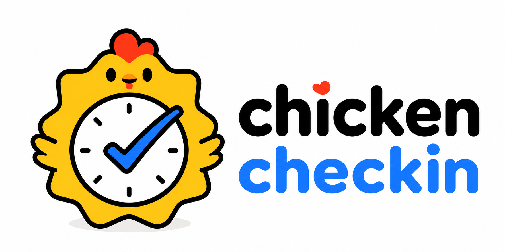

# 小鸡打卡ChickenCheckin

  

网站：[https://chickencheckin.pages.dev/](https://chickencheckin.pages.dev/)

目前仅支持邀请码注册，找回密码需使用恢复码

Email: 95849578@qq.com

## 版本说明

### 1.04

- 左上角默认名称改为“点击修改”，点击后可以设置自己的显示名称；自定义名称会随账号同步。
- 浏览器标签页名称固定为 `ChickenCheckin`，不会再跟随用户自定义名称变化。
- 浏览器及网站 Logo 使用黄底小鸡时钟图，默认头像使用白底小鸡时钟图；头像仍支持点击上传并同步。
- 重新设计 README 首页，加入横向品牌图、网站地址、注册与密码找回说明、联系邮箱和完整版本记录。

### 1.03

- 新增账号注册、登录、退出和跨设备自动云同步；不同账号的数据相互隔离，不限制注册账号数量。
- 注册需要邀请码，同一账号在其他设备登录后会自动恢复云端记录。
- 同步密码至少 6 位；忘记密码时可使用恢复码设置新密码。
- 云端使用 Cloudflare Pages Functions 与 D1 保存账号和同步数据；登录状态可在设备上保持，不必每次同步都重新登录。
- 左下角加入“导出数据”“导入数据”和“云同步”入口，便于升级网站前进行本地备份。
- 名称、头像、主题背景、健康生活选项、运动项目和自定义倒计时等个性化设置均可同步。
- 新增自定义头像上传，默认头像使用应用 Logo。
- 主题颜色扩展为五种固定颜色和一种炫彩背景模式；炫彩模式支持上传背景图并自动提取匹配主题色。
- 自定义倒计时数量上限由 5 个提高到 12 个，并在三个主要页面顶部统一展示。
- 运动打卡改为右上角铅笔编辑，可自由选择游泳、羽毛球、健身、骑行、跑步、篮球、散步、排球、网球、游戏、足球、乒乓球、拳击、射击、滑雪、爬山、广场舞和按摩等项目。
- “今日状态”更换图标，并为今日运动、今日专注补充统计来源提示。
- 美化“打卡记录”的月份选择器。

### 1.02

- “运动记录”升级为“生活记录”，整合运动打卡、番茄时钟和健康生活。
- 番茄时钟提供 30、60、120 分钟模式，点击的时长按钮会显示为当前选中状态，完成周期后自动记录专注时间。
- 健康生活支持按需展示充足睡眠、好好吃饭、按时吃药、复盘总结、放眼远眺、停止内耗和起身活动；今日心情固定展示。
- 今日心情使用 0～100 分拖动条记录，并转换为带表情的心情描述。
- 今日运动和今日专注支持通过状态卡片手动修正累计时长。
- “数据统计”升级为“当月日历”，每周从星期一开始，可切换任意月份。
- 日历每天集中展示心情、运动类型与时长、专注时长及“今日完成”记录。
- 当日和昨日支持通过右上角铅笔编辑；可增加、修改或删除“今日完成”，并可删除心情、运动和专注记录。
- 月历中的所有日期卡片会自动统一为当月最高卡片的高度，保持版面整齐。

### 1.01

- 首页倒计时包括目标星期、下一个法定节假日和本年度结束时间；目标星期可通过铅笔修改。
- 支持添加带名称和日期的自定义倒计时。
- 日期显示完整年份、月份、日期和星期，并加入万年历今日宜忌信息。
- 首页“目标与计划”调整为常驻的“计划与记录”模块。
- “本月核心目标”改为“近期待办”，支持添加、完成和删除；未处理的内容会长期保留。
- “今日待办”改为“今日完成”，记录当天已经完成的事项，仅保留添加和删除操作。
- 首页删除“今日状态”，并将状态统计移动到生活记录页面顶部。
- 删除独立的番茄专注页面和左下角心情主题入口，统一整体视觉风格。

### 1.00

- 建立网页版可视化自律打卡系统，包含首页概览、生活记录和数据统计三个主要页面。
- 首页提供上午、中午、晚上的限时打卡，分别在规定时间段内开放按钮。
- 提供当天日期、时间、倒计时、小日历、近期待办和今日完成记录。
- 支持运动计时、专注计时、健康习惯与心情记录。
- 所有日常记录首先保存在浏览器本地，可按月份回看。
- 采用蓝色清爽卡片式界面，并兼顾电脑和移动设备显示。
